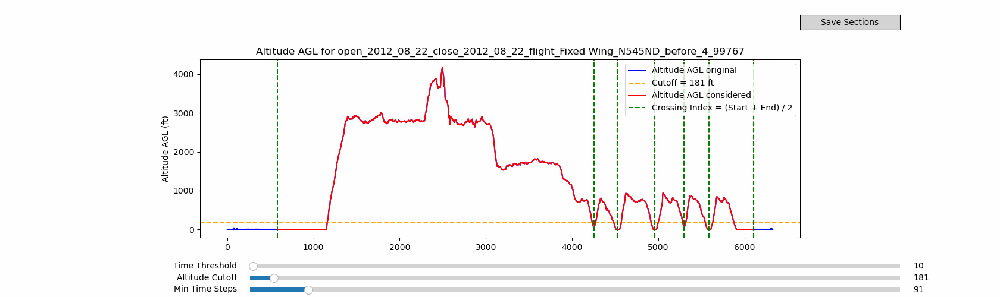

# NGAFID Data Processor

**Interactive Flight Data Annotation Tool for Anomaly Detection**

*Masters Capstone Project - Anomaly Detection on National General Aviation Flight Information Database*



## Overview

The NGAFID Data Processor is an interactive matplotlib-based annotation tool developed for aviation safety analysis. This system enables domain experts to efficiently process and annotate flight data from the National General Aviation Flight Information Database (NGAFID) for anomaly detection research.

## Key Features

**Interactive Real-Time Annotation**
- Live parameter adjustment with immediate visual feedback
- Real-time flight segmentation based on configurable altitude thresholds
- Interactive matplotlib interface with sliders for threshold tuning

**Automated Flight Processing**
- Intelligent flight phase detection and segmentation
- Batch processing capabilities with resumable workflows
- Event-based data organization with unique identifiers

**Professional Data Pipeline**
- Configurable processing parameters via JSON configuration
- Robust error handling and data validation
- Automated frame capture for documentation and analysis

## Configuration

The system uses `config.json` for parameter customization:

- **CUTOFF** - Minimum altitude threshold for valid flight segments (default: 100 ft)
- **TIME_THRESHOLD** - Minimum duration for segment validation (default: 10 seconds)
- **MIN_TIME_STEPS_PER_FILE** - Minimum data points required per segment (default: 90)  

## Installation

Install required dependencies:

```bash
pip install -r requirements.txt
```

## Usage

### Interactive Annotation Mode
Launch the GUI interface for real-time flight data annotation:

```bash
python main.py
```

The interactive interface provides:
- Real-time altitude profile visualization
- Configurable threshold parameters via sliders
- Immediate visual feedback for segmentation results
- One-click export of validated flight segments

### Automated Processing Mode
For batch processing without GUI interaction, modify `main.py` to call `process_auto()` instead of `launch_gui()`.

## Data Validation

The system includes comprehensive data validation through `file_checks.py`:

- File integrity verification and column validation
- Data consistency checks and anomaly detection
- Quick visualization tools for data quality assessment

```bash
python file_checks.py
```

## Technical Implementation

**Core Components:**
- `NGAFID_events_processor.py` - Main processing engine with interactive GUI
- `main.py` - Application entry point and workflow management
- `utils.py` - Utility functions for file handling and configuration
- `config.json` - System configuration and processing parameters

**Key Technologies:**
- Matplotlib for interactive visualization and annotation interface
- Pandas for efficient flight data processing and manipulation
- NumPy and SciPy for numerical computations and signal processing

## Research Context

This tool was developed as part of a Masters Capstone project focused on anomaly detection in aviation data. The interactive annotation capability enables domain experts to efficiently label flight data for machine learning model training and validation in aviation safety research.

